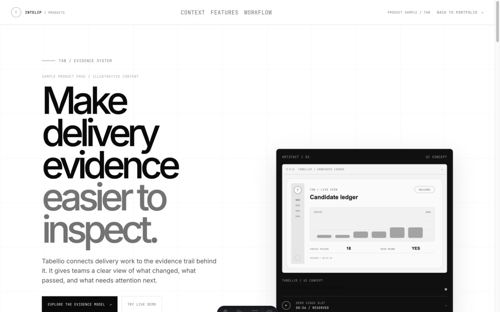
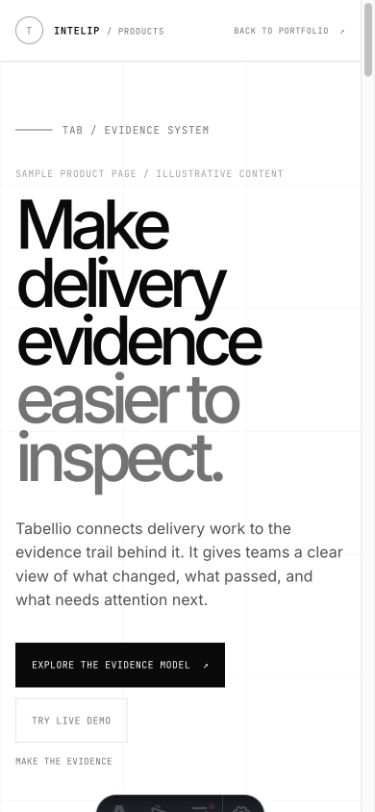
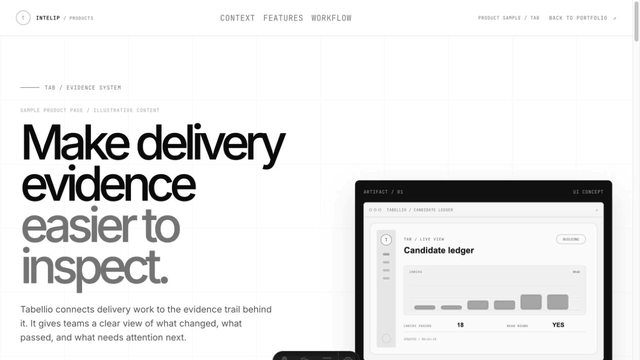

# PortfolioSiteTemplate

> A forkable Astro starter for product websites that need to be clear, credible, and quick to launch.

Edit product content files. Keep the shared skeleton for layout, accessibility,
SEO, crawlable routes, visual proof, and optional interactive demos.

## See the starter

The sample site is a static-first product portfolio with a monochrome base,
product-level accents, and a local interactive demo.

| Desktop | Mobile |
| :---: | :---: |
|  |  |



[Download the higher-quality MP4 scroll preview](public/media/portfolio-template-scroll.mp4).

## Why teams fork it

- **Content-led:** add a product without rewriting shared components.
- **Static-first:** meaningful HTML, links, headings, metadata, and structured data work without client-side JavaScript.
- **Proof-ready:** include product media and an optional local Live Mockup so visitors can see the idea in context.
- **Discoverable:** each public product gets a unique URL plus canonical metadata, sitemap, robots rules, `llms.txt`, and JSON-LD.
- **Controlled launch:** package and Cloudflare deployment are explicit actions, not hidden side effects.
- **Safe defaults:** analytics uses a no-op provider until a project deliberately enables OpenPanel.

## Golden path

1. **Fork** this private repository into the project’s own repository.
2. **Configure** the site identity and origin.
3. **Add** product content files and matching media.
4. **Validate** the content, static output, accessibility contract, and launch kit.
5. **Preview and approve** the rendered page, claims, links, and Lighthouse result.
6. **Deploy** the approved static output to Cloudflare when credentials and domain setup are ready.

The normal path changes content and configuration only. Shared components stay
untouched unless the product genuinely needs a new page capability.

## Quick start

Requirements: Node.js 22+ and npm.

```sh
npm ci
cp .env.example .env
npm run dev
```

Open `http://localhost:4321/`. The sample portfolio is at `/`; sample product
pages are under `/projects/`.

## Fork and customize

Configure the fork first:

```ts
// src/config/site.ts
export const siteName = "Your Product Studio";
export const siteDescription = "A plain-English description of the site.";
```

Create a product content file from the starter:

```sh
npm run new:product -- signal-desk
```

Edit the generated file at `src/content/products/signal-desk.md`, add any
referenced media under `public/media/`, and set `visibility: public` only after
the page is approved. The result is a crawlable page at
`/projects/signal-desk/` using the same route, layout, metadata, and design
system as every other product.

### One small edit, visible result

The generated content file starts with placeholder hero copy:

```diff
-name: Replace with product name
+name: Signal Desk
...
-  title: Product title
-  titleAccent: Signal
+  title: Turn scattered signals
+  titleAccent: into a clear next move.
+visibility: public
```

That content-only change produces a new product card, a new URL, and an H1
that reads “Turn scattered signals into a clear next move.” The shared
`ProductPage` component, route, responsive CSS, SEO builders, and validators do
not change. Keep the rest of the generated fields complete; the content schema
will identify missing product facts before launch.

**Before:** placeholder product name and hero copy. **After:** a named,
publicly discoverable product page with its own plain-English promise.

## What changes per project?

```text
YOUR FORK
├── EDIT: project content and identity
│   ├── src/config/site.ts
│   ├── src/content/products/*.md       product content files
│   ├── public/media/*                   screenshots, diagrams, demo media
│   └── .env                             local/deployment configuration
│
└── KEEP SHARED: product-kit skeleton
    ├── src/layouts/Shell.astro         HTML shell and metadata
    ├── src/pages/projects/[slug].astro generated product routes
    ├── src/components/ProductPage.astro shared page grammar
    ├── src/components/LiveMockup.astro optional demo container
    ├── src/config/seo.mjs              JSON-LD builders
    ├── src/pages/robots.txt.ts         robots rules
    ├── src/pages/sitemap.xml.ts        sitemap generation
    └── src/pages/llms.txt.ts            agent-readable site index
```

Content belongs in the fork. Routing, landmarks, design tokens, accessibility
hooks, structured-data scaffolding, and validation belong to the kit.

## Feature tour

### A clear product page

Each public product page provides a literal H1, two-sentence description,
audience, problem, solution, features, proof points, and a primary call to
action. Important meaning remains visible in normal HTML and Markdown.

### A local Live Mockup

Products can embed a realistic interactive sample with local-only state. The
shared container supports responsive desktop/mobile preview, reset behavior,
keyboard-accessible controls, and product-specific demo configuration. See
[docs/live-mockups.md](docs/live-mockups.md).

### A neutral visual system

The base language uses black, white, gray, strong type, and restrained grids.
Each product can provide one accent color without turning product identity into
generic status signaling. See [docs/design-language.md](docs/design-language.md).

### Discovery built in

The generated output includes unique product URLs, canonical tags, Open Graph
metadata, `robots.txt`, `sitemap.xml`, `llms.txt`, and JSON-LD. See
[docs/seo-and-agent-discovery.md](docs/seo-and-agent-discovery.md).

## Launch-ready checklist

Use this checklist before making a product public or approving a deployment:

- [ ] `src/config/site.ts` has the correct site name and plain-English description.
- [ ] `PUBLIC_SITE_URL` points to the intended HTTPS origin in the launch environment.
- [ ] Every public product has complete product content files, realistic claims, descriptive links, and useful body copy.
- [ ] Product images and demo media have descriptive alt text and are committed under `public/media/`.
- [ ] Product visibility is intentional; private or internal work is not in navigation, the sitemap, or `llms.txt`.
- [ ] `npm run validate:profile`, `npm run test:product-kit`, `npm run validate:launch-kit`, and `npm run build` pass on the approved candidate.
- [ ] Rendered desktop and mobile pages have been inspected, including keyboard focus and the Live Mockup if enabled.
- [ ] Lighthouse CI passes the configured `0.90` minimum for performance, accessibility, best practices, and SEO on the approved public sample page, with the report retained as release evidence.
- [ ] Analytics choice is explicit: disabled, or OpenPanel configured with consent and do-not-track behavior reviewed.
- [ ] Cloudflare project, domain/DNS ownership, and deployment credentials are verified separately before the explicit deploy step.
- [ ] Post-deploy smoke check confirms the homepage, each public product URL, `robots.txt`, `sitemap.xml`, and `llms.txt`.

## Technical model

A **product content file** is a Markdown manifest: YAML frontmatter supplies
structured product fields, and the Markdown body supplies readable narrative.
The content collection validates required fields before the route builds. Use
the [product-kit guide](docs/product-kit.md) for the full contract and the
shared-skeleton map.

The generated pages remain useful with JavaScript disabled. The Live Mockup is
progressive enhancement, not the source of product meaning. Product media
supports the explanation; it does not replace it.

### Local validation

Run the short contract first, then the full static build:

```sh
npm run validate:profile
npm run test:product-kit
npm run test:live-mockup
npm run test:analytics
npm run typecheck
PUBLIC_SITE_URL=https://your-domain.example npm run build
npm run lighthouse:ci
```

The validators check design tokens, content manifests, mockup behavior,
analytics privacy/provider contracts, heading structure, landmarks, metadata,
JSON-LD, internal links, sitemap coverage, and `llms.txt` coverage.
Lighthouse CI audits the production `dist/` output at the home page and sample
product page. It runs three times and requires at least `0.90` for performance,
accessibility, best practices, and SEO; see [the Lighthouse configuration](lighthouserc.json).

### Optional analytics

Analytics is disabled by default. Events go through a provider-neutral
measurement interface; shared UI does not call an OpenPanel SDK directly. The
OpenPanel provider supports consent, Do Not Track, Global Privacy Control, and
graceful failure. Configure it only when the project has completed its privacy
review. See [docs/analytics.md](docs/analytics.md).

### Cloudflare and domains

`npm run package` creates a release artifact. Terraform under
`infra/cloudflare-pages/` prepares Cloudflare Pages configuration, while
`npm run deploy:cloudflare` remains explicit and credential-gated. It does not
create a project or configure DNS. Domain search/check helpers are read-only;
registration remains a separate approved action. See
[docs/rapid-launch.md](docs/rapid-launch.md) and
[infra/cloudflare-pages/README.md](infra/cloudflare-pages/README.md).

### README visual assets

The screenshots and scrolling preview above document the Tabellio sample page;
they are not loaded by the site at runtime. Capture guidance and the
dependency-free GIF generator live in [docs/readme-assets.md](docs/readme-assets.md).

## Repository map

```text
src/config/             Shared site, SEO, and structured-data configuration
src/content/products/   Project-specific product content files
src/components/         Shared page and Live Mockup components
src/layouts/            Shared HTML shell and metadata
src/analytics/          Provider-neutral measurement layer
public/media/           Product and README visual proof
docs/                   Forking, design, SEO, mockup, analytics, and launch guides
infra/cloudflare-pages/ Cloudflare Pages infrastructure notes
scripts/                Content, validation, packaging, and demo-asset helpers
```

## Further reading

- [Product kit guide](docs/product-kit.md)
- [Design language](docs/design-language.md)
- [SEO and agent discovery](docs/seo-and-agent-discovery.md)
- [Live Mockups](docs/live-mockups.md)
- [Analytics](docs/analytics.md)
- [Rapid launch](docs/rapid-launch.md)
- [README visual assets](docs/readme-assets.md)

This is a private template and local launch kit. It does not deploy, create DNS
records, provision production resources, or enable analytics automatically.
